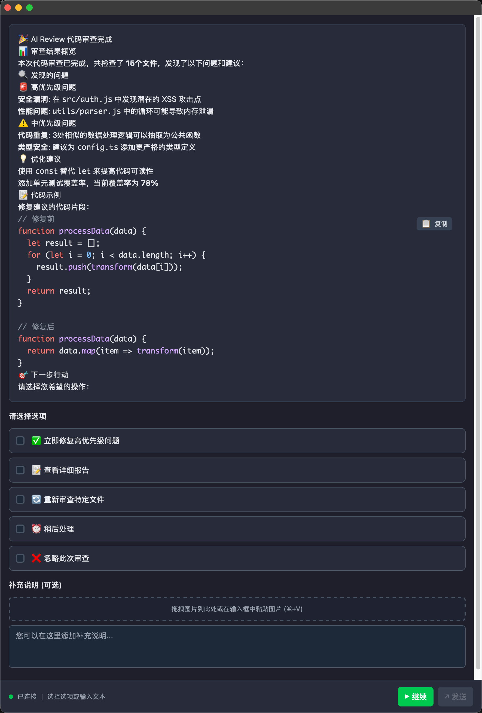

# 寸止

## 告别AI提前终止烦恼，助力AI更加持久

寸止 是一个基于 MCP (Model Context Protocol) 的智能交互工具，提供弹窗交互和全局记忆管理功能，让AI助手更加持久和智能。

## ✨ 特性

- 🎯 **MCP 标准兼容**: 完全符合 MCP 2024-11-05 协议规范
- 🎨 **美观的弹窗界面**: 使用 Vue 3 + Tailwind CSS 构建的现代化UI
- 🔒 **安全的 Markdown 渲染**: 支持代码高亮和安全的内容渲染
- 🖥️ **原生应用体验**: 基于 Tauri 的跨平台桌面应用
- ⚡ **高效通信**: 使用进程间通信，响应迅速
- 🛠️ **灵活交互**: 支持预定义选项、多选和自由文本输入
- 🧠 **全局记忆管理**: 智能存储和管理开发规范、用户偏好和最佳实践
- 📷 **图片支持**: 支持图片上传和Base64处理

## 📸 功能演示

### 智能弹窗界面



_寸止 的现代化弹窗界面，支持 Markdown 渲染、代码高亮、预定义选项和自由文本输入_

## 🚀 快速安装

### 方式一：使用安装脚本（推荐）

```bash
# 克隆仓库
git clone https://github.com/imhuso/cunzhi.git
cd cunzhi

# 运行安装脚本
chmod +x install.sh
./install.sh
```

### 方式二：下载预编译版本

从 [Releases](https://github.com/imhuso/cunzhi/releases) 页面下载对应平台的预编译版本：

- **Linux**: `cunzhi-cli-v*-linux-x86_64.tar.gz`
- **macOS (Intel)**: `cunzhi-cli-v*-macos-x86_64.tar.gz`
- **macOS (Apple Silicon)**: `cunzhi-cli-v*-macos-aarch64.tar.gz`
- **Windows**: `cunzhi-cli-v*-windows-x86_64.zip`

**安装步骤**：
1. 下载对应平台的压缩包并解压
2. 将 `寸止` 和 `等一下` 两个CLI工具放置到任意目录
3. 可选择添加到PATH环境变量，或使用绝对路径调用

**部署示例**：
```bash
# Linux/macOS - 全局安装
tar -xzf cunzhi-cli-v*-linux-x86_64.tar.gz
sudo cp 寸止 等一下 /usr/local/bin/

# Linux/macOS - 用户目录
tar -xzf cunzhi-cli-v*-linux-x86_64.tar.gz
mkdir -p ~/.local/bin
cp 寸止 等一下 ~/.local/bin/
echo 'export PATH="$PATH:~/.local/bin"' >> ~/.bashrc

# Windows - 自定义目录
# 解压 zip 文件到 C:\cunzhi
# 可选：将 C:\cunzhi 添加到系统 PATH
```

## 📋 部署配置

### MCP 客户端配置

将以下配置添加到您的 MCP 客户端配置文件中：

```json
{
  "mcpServers": {
    "寸止": {
      "command": "寸止"
    }
  }
}
```

**注意**：如果 `寸止` 不在PATH中，请使用绝对路径：
```json
{
  "mcpServers": {
    "寸止": {
      "command": "/path/to/寸止"
    }
  }
}
```

### 工具协作机制

寸止包含两个CLI工具，它们之间有智能的协作机制：

- **寸止**：MCP服务器，处理AI客户端的请求
- **等一下**：弹窗界面，提供用户交互

**自动发现逻辑**：
1. 当MCP服务器需要显示弹窗时，会自动查找 `等一下` 工具
2. 查找顺序：同目录 → PATH环境变量 → 错误提示
3. 这意味着您可以将两个工具放在任何位置，只要它们能被找到即可

## 🛠️ MCP 工具

### 1. zhi - 智能交互工具

弹窗交互工具，支持多种输入方式和Markdown渲染。

**主要参数**：
- `message` (必需): 显示给用户的消息内容
- `predefined_options` (可选): 预定义选项列表，支持多选
- `is_markdown` (可选): 是否启用Markdown格式渲染

**功能特性**：
- ✅ 预定义选项多选 + 自由文本输入
- ✅ 图片上传和Base64处理
- ✅ Markdown渲染和代码高亮
- ✅ 现代化暗黑主题UI

### 2. jiyi - 全局记忆管理工具

智能记忆管理系统，按项目存储开发规范和偏好设置。

**主要参数**：
- `action` (必需): 操作类型 ("记忆" 或 "回忆")
- `project_path` (必需): 项目路径
- `content` (记忆时必需): 记忆内容
- `category` (可选): 记忆分类 (rule/preference/pattern/context)

**功能特性**：
- ✅ 按项目自动组织记忆
- ✅ 智能分类管理 (规范/偏好/模式/上下文)
- ✅ Git仓库根目录自动识别
- ✅ 压缩格式输出，节省token

## 📋 使用方法

### 启动MCP服务器
```bash
寸止
```

### 启动弹窗界面
```bash
等一下                          # 启动设置界面
等一下 --mcp-request file       # MCP弹窗模式
```

### 版本管理
```bash
# 查看当前版本
node scripts/version.js --current

# 发布新版本
./scripts/release.sh
```

## 📁 项目结构

```
cunzhi/
├── src/
│   ├── mcp/tools/
│   │   ├── memory/          # 记忆管理工具
│   │   └── interaction/     # 智能交互工具
│   ├── assets/sounds/       # 音频资源
│   ├── main.rs              # Tauri 主应用
│   └── bin/mcp_server.rs    # MCP 服务器
├── scripts/
│   ├── release.sh           # 发布脚本
│   ├── version.js           # 版本管理
│   └── README.md            # 脚本使用说明
├── .github/workflows/
│   └── build.yml            # 跨平台构建
├── install.sh               # 安装脚本
├── Cargo.toml               # Rust 配置
├── package.json             # Node.js 配置
├── tauri.conf.json          # Tauri 配置
└── version.json             # 版本配置
```

## 🧪 开发

### 本地开发

```bash
# 安装依赖
pnpm install

# 开发模式运行前端
pnpm dev

# 构建并运行 MCP 服务器
cargo build --release
./target/release/寸止
```

### 构建发布版本

```bash
# 构建前端
pnpm build

# 构建 CLI 工具
cargo build --release

# 运行安装脚本
./install.sh
```

## 🔧 故障排除

### 构建问题

如果遇到构建错误，请检查以下几点：

1. **Linux 系统依赖**：
   ```bash
   # Ubuntu/Debian
   sudo apt-get install pkg-config libgtk-3-dev libasound2-dev

   # CentOS/RHEL
   sudo yum install pkgconfig gtk3-devel alsa-lib-devel
   ```

2. **Windows 构建**：
   - 确保安装了 Visual Studio Build Tools
   - 使用 PowerShell 或 CMD 运行构建命令

3. **macOS 构建**：
   - 确保安装了 Xcode Command Line Tools
   ```bash
   xcode-select --install
   ```

### 运行时问题

- **权限问题**：确保 CLI 工具有执行权限
- **路径问题**：确保两个工具在同一目录或都在 PATH 中
- **依赖问题**：检查系统是否安装了必要的运行时库

## 🤝 贡献

欢迎提交 Issue 和 Pull Request！

## 📄 许可证

MIT License
