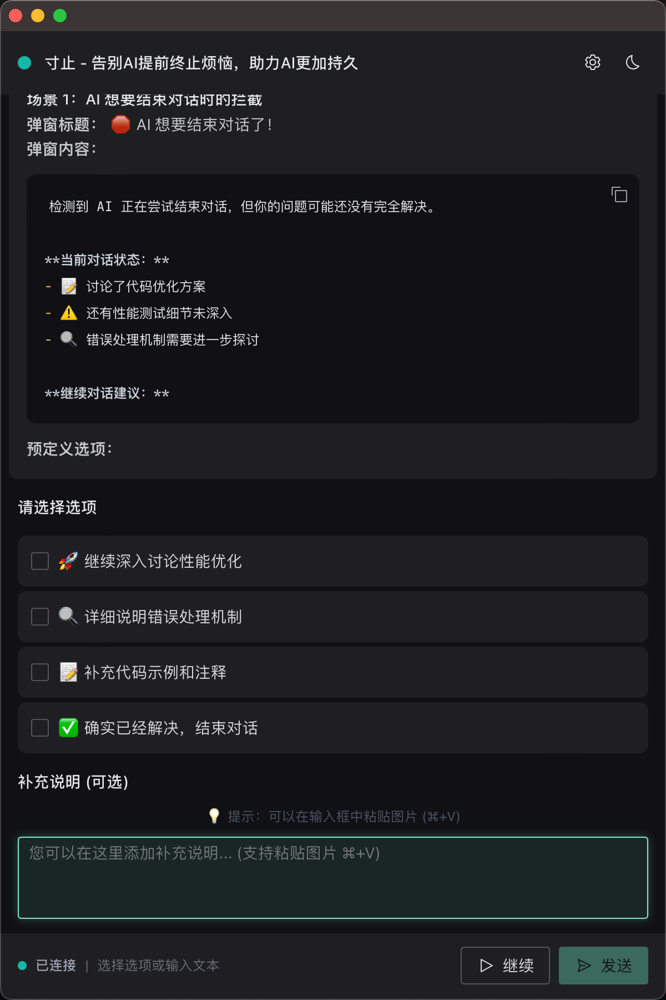
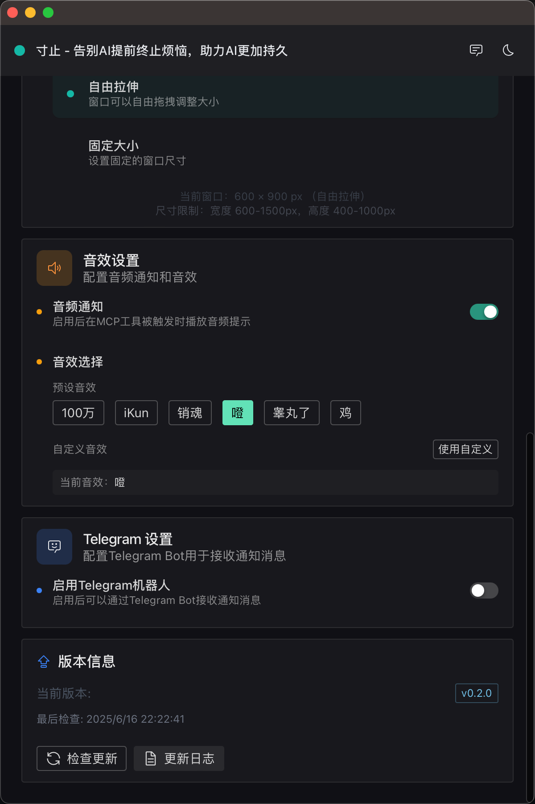

# 寸止 🛑

> **AI 对话"早泄"终结者，让交流持续到底**

还在为 AI 助手总是提前结束对话而抓狂吗？明明还有很多要聊，它却说"还有什么需要帮助的吗？"**寸止** 专治这个毛病！

当 AI 想要"草草了事"时，寸止会及时弹出对话框，让你能够继续深入交流，直到真正解决问题为止。

## 🌟 核心特性

- 🛑 **智能拦截**：AI 想结束时自动弹出继续选项
- 🧠 **记忆管理**：按项目存储开发规范和偏好
- 🎨 **优雅交互**：Markdown 支持、多种输入方式
- ⚡ **即装即用**：3 秒安装，跨平台支持

## 📸 看看效果

### 🛑 智能拦截弹窗


*当 AI 想要结束对话时，寸止智能弹窗及时出现，提供预定义选项快速选择，让交流持续深入*

### ⚙️ 设置管理界面


*优雅的设置界面，支持记忆管理、功能开关、主题切换和智能提示词生成*

## 🚀 开始使用

### 方式一：快速安装（推荐）

**macOS 用户：**
```bash
# 3 秒安装，无需等待编译
brew tap imhuso/cunzhi && brew install cunzhi
```

> ⚠️ **故障排除**：如果遇到 404 下载错误，请执行以下步骤：
>
> ```bash
> # 清除旧的 tap 缓存
> brew untap imhuso/cunzhi
> # 重新安装
> brew tap imhuso/cunzhi && brew install cunzhi
> ```
>
> **常见错误示例：**
> ```
> curl: (56) The requested URL returned error: 404
> Error: cunzhi: Failed to download resource "cunzhi"
> Download failed: https://github.com/imhuso/cunzhi/releases/download/v0.2.0/cunzhi-cli-v0.2.4-macos-aarch64.tar.gz
> ```
>
> 这通常是由于之前版本的缓存问题导致版本号不匹配。清除 tap 后重新安装即可解决。

**Windows/Linux 用户：**
推荐使用方式二手动下载，简单快捷！

### 方式二：手动下载

1. 访问 [Releases 页面](https://github.com/imhuso/cunzhi/releases)
2. 下载适合你系统的版本：
   - 🐧 **Linux**: `cunzhi-cli-v*-linux-x86_64.tar.gz`
   - 🍎 **macOS (Intel)**: `cunzhi-cli-v*-macos-x86_64.tar.gz`
   - 🍎 **macOS (Apple Silicon)**: `cunzhi-cli-v*-macos-aarch64.tar.gz`
   - 🪟 **Windows**: `cunzhi-cli-v*-windows-x86_64.zip`

3. 解压后将 `寸止` 和 `等一下` 添加到系统 PATH

## ⚡ 快速上手

### 第一步：配置 MCP 客户端

在你的 MCP 客户端（如 Claude Desktop）配置文件中添加：

```json
{
  "mcpServers": {
    "寸止": {
      "command": "寸止"
    }
  }
}
```

### 第二步：打开设置界面

```bash
# 运行设置命令
等一下
```

### 第三步：配置提示词

在设置界面的"参考提示词"标签页：
1. 查看自动生成的提示词
2. 点击复制按钮
3. 将提示词添加到你的 AI 助手中

### 第四步：开始使用

现在你的 AI 助手就拥有了智能拦截、记忆管理和弹窗交互功能！

> 💡 **小贴士**：你可以参考生成的提示词进行个性化修改，打造专属的 AI 交互体验。

## 🤝 参与贡献

寸止是开源项目，我们欢迎所有形式的贡献！

### 🐛 发现问题？
- [提交 Issue](https://github.com/imhuso/cunzhi/issues) 描述问题
- 提供复现步骤和环境信息

### 💡 有好想法？
- [发起讨论](https://github.com/imhuso/cunzhi/discussions) 分享你的想法
- 提交 Pull Request 实现新功能

### 🛠️ 本地开发
```bash
git clone https://github.com/imhuso/cunzhi.git
cd cunzhi
pnpm install
pnpm tauri:dev
```

## 📞 联系我们

- 🐛 **问题反馈**：[GitHub Issues](https://github.com/imhuso/cunzhi/issues)
- 💬 **功能讨论**：[GitHub Discussions](https://github.com/imhuso/cunzhi/discussions)
- ⭐ **喜欢项目**：给我们一个 Star 支持！

## 📄 开源协议

MIT License - 自由使用，欢迎贡献！

---

<div align="center">

**告别 AI 对话"早泄" | 让每次交流都持续到底**

[⭐ Star](https://github.com/imhuso/cunzhi) · [🐛 Report Bug](https://github.com/imhuso/cunzhi/issues) · [💡 Request Feature](https://github.com/imhuso/cunzhi/discussions)

</div>
